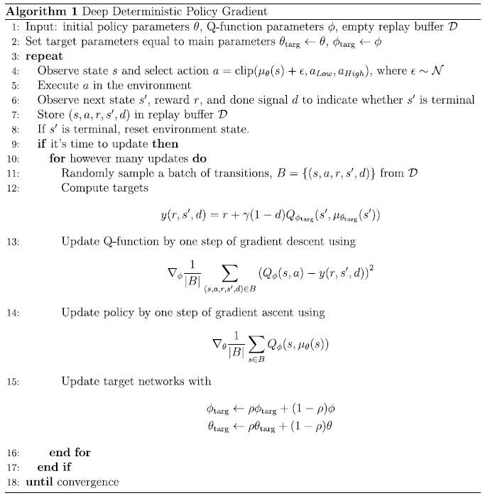
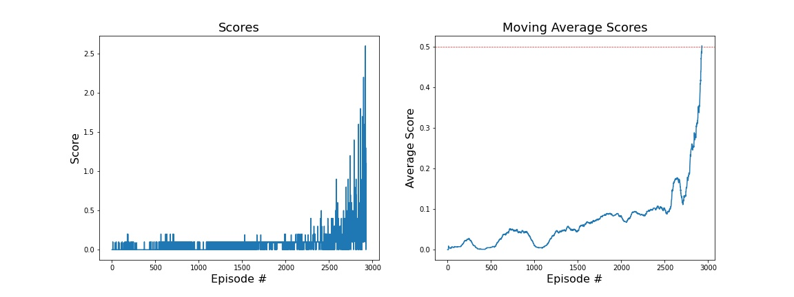
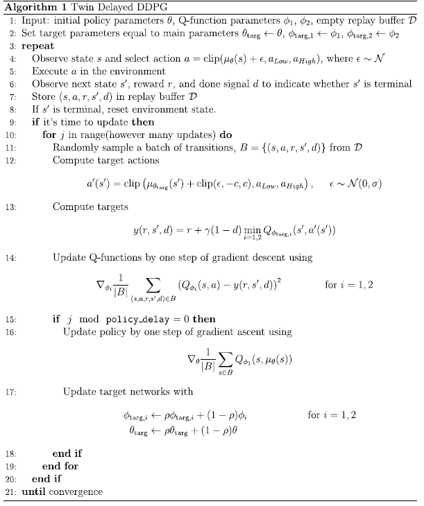

# DeepRLTennis : Collaboration and Competition

## Executive Summary

For this project, I worked with the [Tennis](https://github.com/Unity-Technologies/ml-agents/blob/master/docs/Learning-Environment-Examples.md#tennis) environment. Two agents control rackets to bounce a ball over a net. If an agent hits the ball over the net, it receives a reward of +0.1. If an agent lets a ball hit the ground or hits the ball out of bounds, it receives a reward of -0.01. The goal of each agent is therefore to keep the ball in play.

The task is episodic, and in order to solve the environment, the agents must get an average score of +0.5 (over 100 consecutive episodes, after taking the maximum over both agents). 

Specifically,

- After each episode, we add up the rewards that each agent received (without discounting), to get a score for each agent. This yields 2 (potentially different) scores. We then take the maximum of these 2 scores.
- This yields a single **score** for each episode.

The environment is considered solved, when the average (over 100 episodes) of those **scores** is at least +0.5. 


## Environment Details

The environment is based on [Unity ML-agents](https://github.com/Unity-Technologies/ml-agents). The project environment provided by Udacity is very similar to the [Tennis](https://github.com/Unity-Technologies/ml-agents/blob/master/docs/Learning-Environment-Examples.md#tennis) environment on the Unity ML-Agents GitHub page. You may want to look at it in action via this [youtube link](https://www.youtube.com/watch?v=RDaIh7JX6RI&ab_channel=Unity).

The Unity Machine Learning Agents Toolkit (ML-Agents) is an open-source Unity plugin that enables games and simulations to serve as environments for training intelligent agents. Agents can be trained using reinforcement learning, imitation learning, neuroevolution, or other machine learning methods through a simple-to-use Python API. 

The observation space consists of 8 variables corresponding to the position and velocity of the ball and racket. Each agent receives its own, local observation.  Two continuous actions are available, corresponding to movement toward (or away from) the net, and jumping. 

### Specifications

- **Set-up**: Two-player game where agents control rackets to bounce ball over a net.
- **Goal**: The agents must bounce ball between one another while not dropping or sending ball out of bounds.
- **Agents**: The environment contains two agent linked to a single Brain named TennisBrain. After training you can attach another Brain named MyBrain to one of the agent to play against your trained model.
- **Agent Reward Function** (independent):
  - +0.1 To agent when hitting ball over net.
  - -0.1 To agent who let ball hit their ground, or hit ball out of bounds.
- **Brains**: One Brain with the following observation/action space.
- **Vector Observation space**: 8 variables corresponding to position and velocity of ball and racket.
  - In the Udacity provided environment, 3 observations are stacked (8 *3 = 24 variables) 
- **Vector Action space**: (Continuous) Size of 2, corresponding to movement toward net or away from net, and jumping.
- **Visual Observations**: None.
- **Reset Parameters**: One, corresponding to size of ball.
- **Benchmark Mean Reward**: 2.5

## The Solution

This project makes use of an *off-policy method* called **Multi Agent Deep Deterministic Policy Gradient (MADDPG)** algorithm. But before we delve into this algorithm,  it is worth noting that MADDPG is largely derived from an an *off-policy method* called [**Deep Deterministic Policy Gradient (DDPG)**](https://arxiv.org/abs/1509.02971). 

### Deep Deterministic Policy Gradient (DDPG)

Deep Deterministic Policy Gradient (DDPG) is an algorithm which concurrently learns a Q-function and a policy. It uses off-policy data and the Bellman equation to learn the Q-function, and uses the Q-function to learn the policy.

DDPG adapts the ideas underlying the success of Deep Q-Learning to the continuous action domain. An actor-critic, model-free algorithm was presented based on the deterministic policy gradient that can operate over continuous action spaces. Using the same learning algorithm, network architecture and hyper-parameters, the DDPG algorithm robustly solves more than 20 simulated physics tasks, including classic problems such as cartpole swing-up, dexterous manipulation, legged locomotion and car driving.


*DDPG Algorithm*

### Multi Agent Deep Deterministic Policy Gradient (MADDPG)

The algorithm that I used for this project is the **Multi Agent Deep Deterministic Policy Gradient (MADDPG)** described in detail in the following paper [Multi-Agent Actor-Critic for Mixed Cooperative-Competitive Environments](https://arxiv.org/abs/1706.02275)

Q-learning is challenged by an inherent non-stationarity of the environment, while policy gradient suffers from a variance that increases as the number of agents grows. MADDPG incorporates the adaptation of actor-critic methods that considers action policies of other agents and one that is able to successfully learn policies that require complex multi-agent coordination. Additionally, MADDPG introduces a training regimen utilizing an ensemble of policies for each agent that leads to more robust multi-agent policies.

Hence, a centralized training framework with decentralized execution is adopted. That is, during training, the Critics networks have access to the states and actions of both agents, while the Actors networks have only access to the information corresponding to the local agent.

 
*MADDPG Algorithm*

### Model Specifics
The code used here is derived from the "DDPG pidedal" tutorial from the [Deep Reinforcement Learning Nanodegree](https://www.udacity.com/course/deep-reinforcement-learning-nanodegree--nd893), and modified to implement the **Multi-Agent Actor Critic**.

The convergence took a lot of effort to do. For instance, using a normal distribution to sample experiences from the Replay Buffer was used. This was also recommended in my previous implementation of the DDPG architecture. Of couse, adding Batch Normalization after the Activation in the first layers of the neural network helped for the solution to converge a bit faster. But I feel like the current implementation is still a bit too slow, as the code is only able to solve the problem after a lot of episodes.


#### MADDPG parameters

Below are the parameters I used. 

```
SEED = 1226                        # Random seed

EPISODES = 10000                   # Max number of episodes
STEPS = 1000                       # Max number of steps per episodes 
BUFFER_SIZE = int(1e6)             # replay buffer size
BATCH_SIZE = 200                   # minibatch size
UPDATE_EVERY_NB_EPISODE = 4        # Number of episodes between learning process
MULTIPLE_LEARN_PER_UPDATE = 3      # Number of multiple learning process performed in a row
EPSILON = 1.0                      # exploration actions space
EPSILON_DECAY = 1e-6               # epsilon decay

LR_ACTOR = 1e-4                    # learning rate of the actor 
LR_CRITIC = 1e-3                   # learning rate of the critic
WEIGHT_DECAY = 0                   # L2 weight decay
ACTOR_FC1_UNITS = 512              # Number of units for the layer 1 in the actor model
ACTOR_FC2_UNITS = 512              # Number of units for the layer 2 in the actor model
CRITIC_FCS1_UNITS = 512            # Number of units for the layer 1 in the critic model
CRITIC_FC2_UNITS = 512             # Number of units for the layer 2 in the critic model

GAMMA = 0.995                      # Discount factor
TAU = 1e-3                         # For soft update of target parameters
CLIP_CRITIC_GRADIENT = False       # Clip gradient during Critic optimization

ADD_OU_NOISE = True                # Add Ornstein-Uhlenbeck noise
NOISE = 1.0                        # Initial Noise Amplitude 
NOISE_REDUCTION = 1.0              # Noise amplitude decay ratio
MU = 0.                            # Ornstein-Uhlenbeck noise parameter
THETA = 0.15                       # Ornstein-Uhlenbeck noise parameter
SIGMA = 0.2                        # Ornstein-Uhlenbeck noise parameter
```

#### Model Structure
I incorporated `EPSILON` and `EPSILON_DECAY` in the ddpg agent class (the same as in my previous project) as this allows the learning to converge much faster. Although, I observe that there is a bit of oscillation happening, that is, scores tend to go back and forth throughout the learning process.

|  Neural Network       |   fc1_units      | fc2_units   | EPSILON | EPSILON_DECAY| output_layer |
|------------|------------------|-------------|-----------|--------------|-----------|
|  Actor     |  512             | 512         |  1.0         | 1e-6         | 2            |
|  Critic    |  512             | 512         |  1.0         | 1e-6         | 1            |


## Results

Given the chosen architecture and parameters indicated above, the model converges nicely to the target score:



The current results meet the project's expectation as the agent is able to receive an average reward (over 100 episodes) of at least +0.5 in 3338 episodes

## Conclusions and Recommendations

While the current implementation of the algorithm achieves the project's goal, I still find the learning a bit unstable as seen in the dip in the plot previously. Hyperparameter tuning should be explored. I ran the simulation on my laptop (with no GPU). 

The **Twin Delayed DDPG (TD3)** alorithm might be a good improvement to the Multi Agents environments according to [OpenAI](https://openai.com/)'s [Spinning Up](https://spinningup.openai.com/en/latest/index.html).

Find below the reasons:

While DDPG can achieve great performance sometimes, it is frequently brittle with respect to hyperparameters and other kinds of tuning. A common failure mode for DDPG is that the learned Q-function begins to dramatically overestimate Q-values, which then leads to the policy breaking, because it exploits the errors in the Q-function. Twin Delayed DDPG (TD3) is an algorithm which addresses this issue by introducing three critical tricks:

- Trick One: Clipped Double-Q Learning. TD3 learns two Q-functions instead of one (hence “twin”), and uses the smaller of the two Q-values to form the targets in the Bellman error loss functions.

- Trick Two: “Delayed” Policy Updates. TD3 updates the policy (and target networks) less frequently than the Q-function. The paper recommends one policy update for every two Q-function updates.

- Trick Three: Target Policy Smoothing. TD3 adds noise to the target action, to make it harder for the policy to exploit Q-function errors by smoothing out Q along changes in action.

Together, these three tricks result in substantially improved performance over the baseline DDPG

See :[Twin Delayed DDPG (TD3)](https://spinningup.openai.com/en/latest/algorithms/td3.html)



